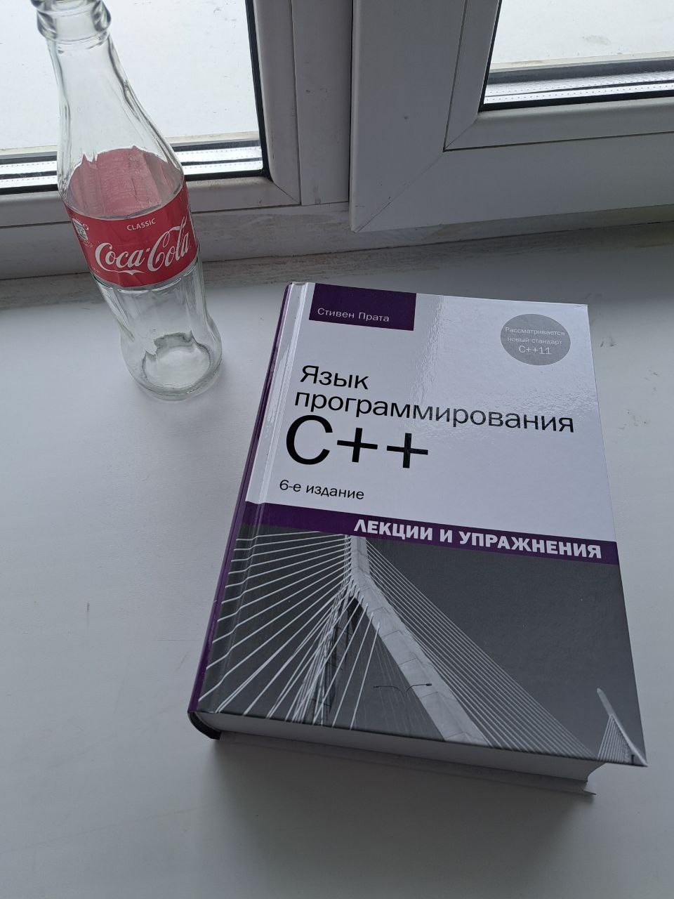

# **Лаборатораня работа №2**

## Задание
Нужно построить траекторию движения камеры по нескольким изображениям одного объекта (со смещением), выполнив следующие пункты:
- Определите на каждой фотографии ключевые точки (например, углы)
- Постройте по каждой точке дескриптор (можете использовать любой, рекомендуется SIFT)
- Сопоставьте два соседних изображения на предмет соответствия ключевых точек (дискрипторов)
- Постройте модель преобразования изображений, учитывайте только поворот и сдвиг
- С учетом полученных моделей постройте траекторию движения камеры

### Файл лабораторной работы с реализованными функциями: [CV_LAB2.ipynb](CV_LAB2.ipynb)

### Исходные изображения: 

*Для ускорения вычислений размер исходных изображений был уменьшен до (600, 800), для этого был использован метод cv2.resize().
**Исходные изображения были переведены в оттенки серого, для этого был использован метод cv2.cvtColor(image, cv2.COLOR_RGB2GRAY).

## Детектор Харриса
Детектор углов Харриса  — это алгоритм обнаружения ключевых точек (углов) в изображении, разработанный Кристофером Харрисом и Майком Стефенсом в 1988 году. Он широко используется в компьютерном зрении для задач, таких как сопоставление изображений, трекинг объектов и 3D-реконструкция. Основная идея метода заключается в поиске точек, где наблюдается значительное изменение яркости в двух перпендикулярных направлениях (углы).

Харрис и Стефенс улучшили детектор Моравеца (Moravec), введя анизотропию по всем направлениям, т.е. рассматривают производные яркости изображения для исследования изменений яркости по множеству направлений. Они вводят в рассмотрение производные по некоторым принципиальным направлениям.

**Детектор Моравеца** – самый простой из существующих. Автор рассматривает изменение яркости квадратного окна W (обычно размера 3х3, 5х5, 7х7 пикселей) относительно интересующей точки при сдвиге окна W на 1 пиксель в 8-ми направлениях (горизонтальных, вертикальных и диагональных).

Взвешенная сумма квадрата разностей:

где w(x,y) – весовая функция (обычно используется функция Гаусса или бинарное окно).

M – автокорреляционная матрица:

Угол характеризуется большими изменениями функции E(x,y) по всем возможным направлениям (x,y), что эквивалентно большим по модулю собственным значениям матрицы M. Расположение собственных значений приведено на следующем рисунке.

Поскольку напрямую считать собственные значения является трудоёмкой задачей, Харрисом и Стефеном была предложена мера отклика:

где k – эмпирическая константа, 

***det(M)*** - модуль матрицы М; ***tr(M)*** - сумма собственных чисел матрицы М.

Таким образом, значение R положительно для угловых особых точек. Затем производится отсечение точек по найденному порогу R (т.е. те точки, у которых значение R меньше некоторого порога, исключаются из рассмотрения).

Ссылка на статью: https://habr.com/ru/articles/244541/

## Дескриптор SIFT

**Дескриптор** – идентификатор особой точки, выделяющий её из остального множества особых точек. В свою очередь, дескрипторы должны обеспечивать инвариантность нахождения соответствия между особыми точками относительно преобразований изображений.

Источник: https://habr.com/ru/articles/106302/

В методе SIFT дескриптором является вектор. Как и направление ключевой точки, дескриптор вычисляется на гауссиане, ближайшем по масштабу к ключевой точке, и исходя из градиентов в некотором окне ключевой точки. Перед вычислением дескриптора это окно поворачивают на угол направления ключевой точки, чем и достигается инвариантность относительно поворота.

SIFT дескрипторы не лишены недостатков. Не все полученные точки и их дескрипторы будут отвечать предъявляемым требованиям. Естественно это будет сказываться на дальнейшем решении задачи сопоставления изображений. В некоторых случаях решение может быть не найдено, даже если оно существует.

## Нахождение соответствий

1. Вычисление Евклидова расстояния
Используется формула Евклидова расстояния:

 
2. Сортировка расстояний :
Расстояния сортируются по возрастанию, чтобы найти два ближайших соседа (тест Лоу)
Если расстояние до ближайшего соседа (m_distance) значительно меньше, чем расстояние до второго ближайшего соседа (n_distance), то соответствие считается хорошим.

## Оценка трансформаций

1. Для каждой пары соответствий из matches извлекаются координаты ключевых точек из keypoints1 и keypoints2.
2. Точки центрируются относительно их центров масс, чтобы устранить влияние сдвига при вычислении поворота.
3. Матрица ковариации H вычисляется как произведение центрированных точек.
4. Разложение по сингулярным числам используется для нахождения матрицы поворота R, которая минимизирует ошибку между точками.
5. Угол поворота вычисляется из матрицы R. Вектор сдвига вычисляется как разница между центрами масс после применения поворота.
6. Матрица преобразования объединяет поворот (R) и сдвиг (t).

